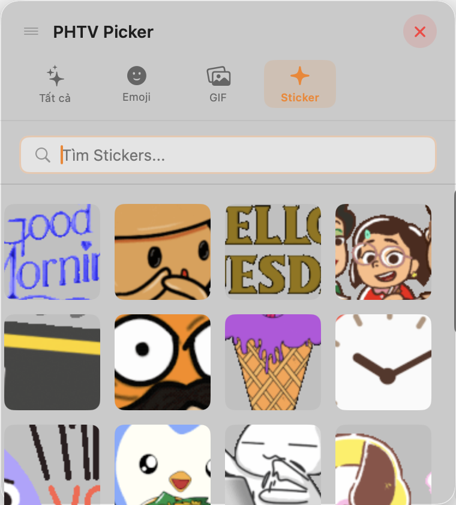
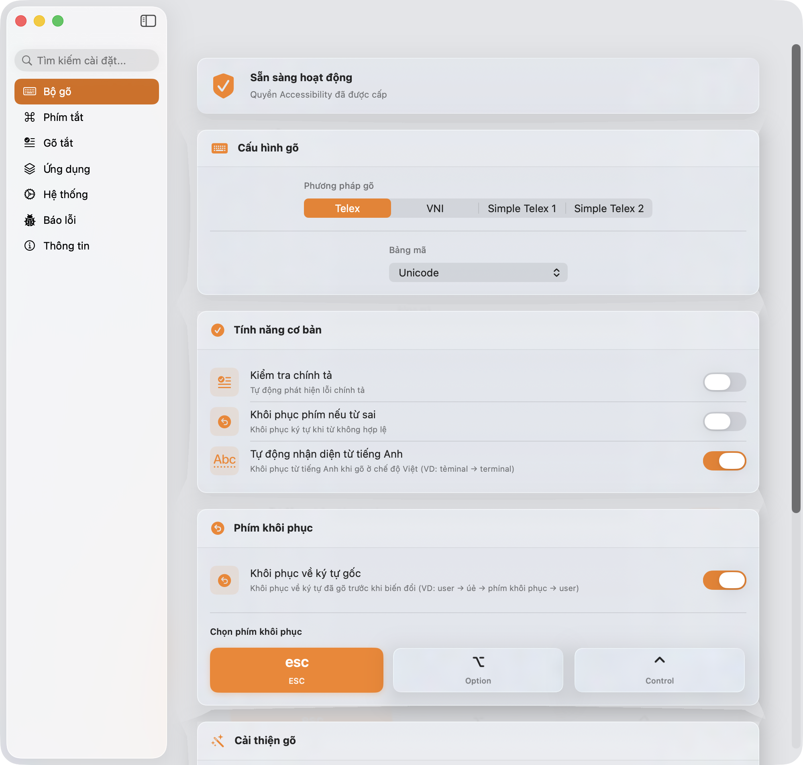
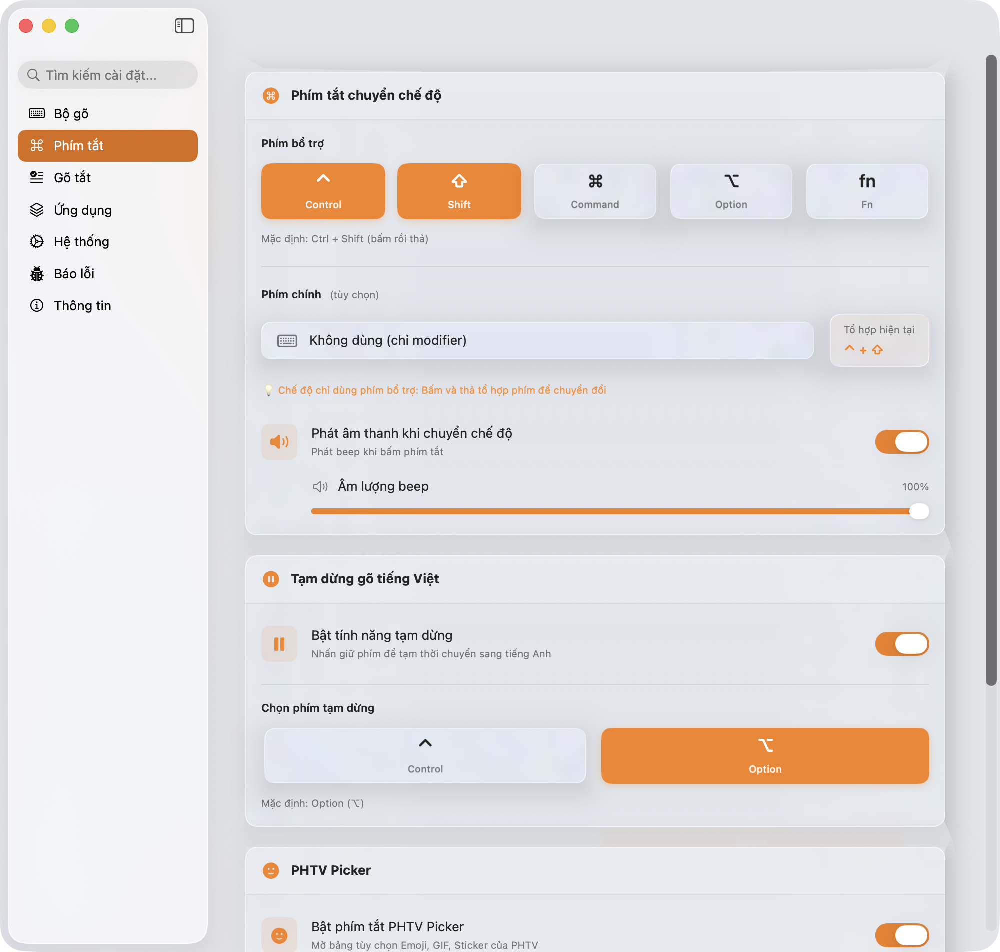
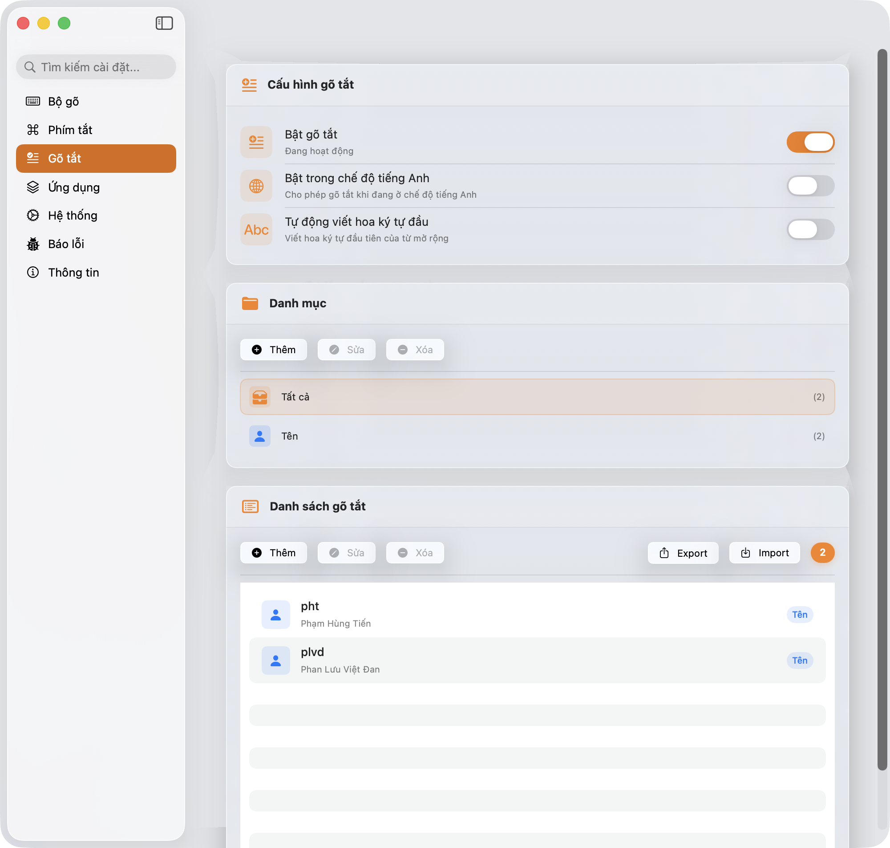
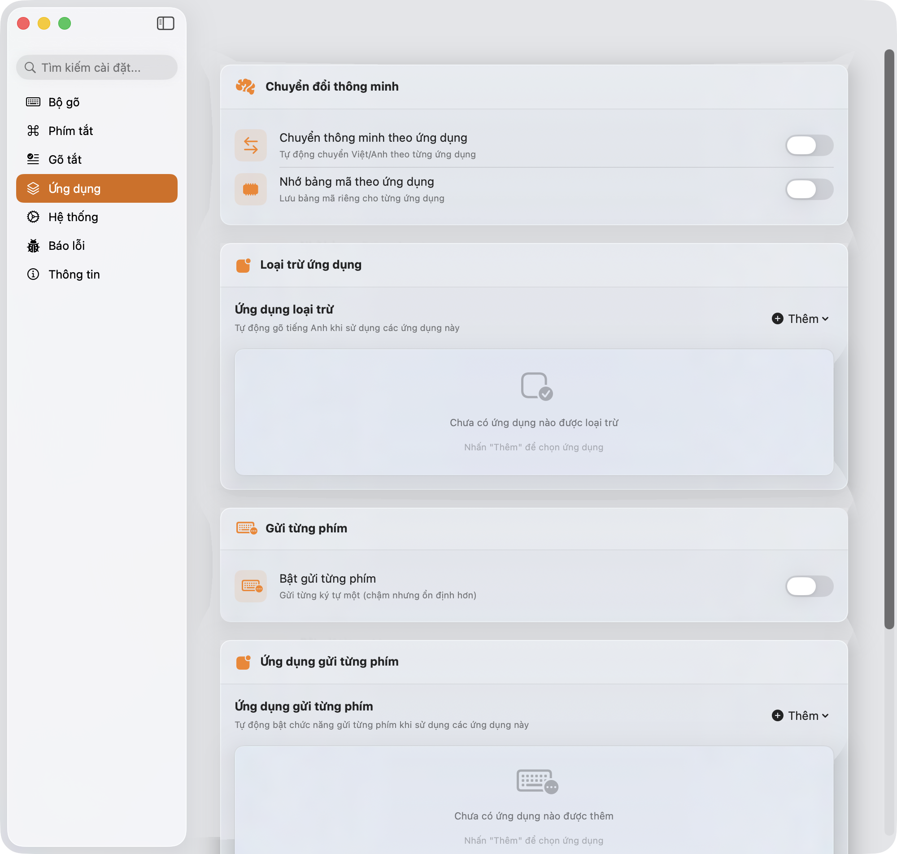
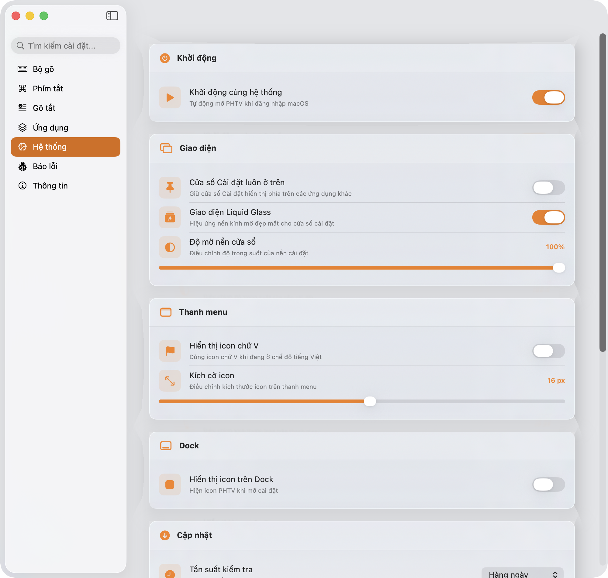
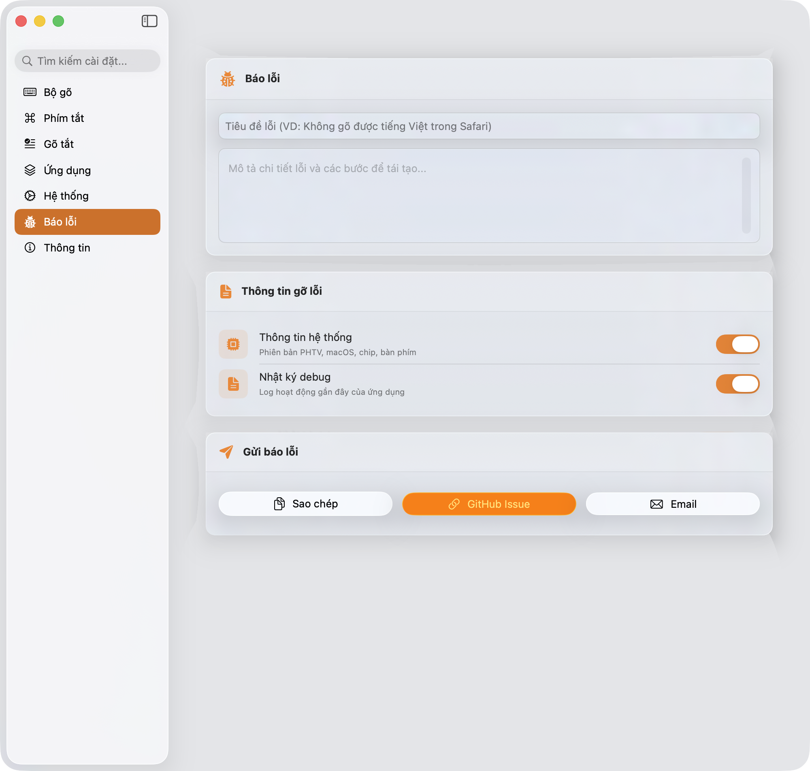
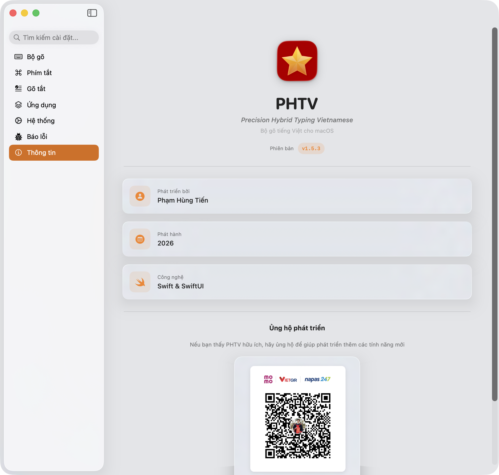

<div align="center">


# PHTV — Precision Hybrid Typing Vietnamese

### Bộ gõ tiếng Việt hiện đại cho macOS

[](https://www.gnu.org/licenses/gpl-3.0)
[](../../actions/workflows/release.yml)
[](https://www.apple.com/macos/)
[](https://support.apple.com/en-us/HT211814)
[](https://swift.org)
[](../../releases/latest)
[](https://sparkle-project.org/)
[](../../releases)
[](../../stargazers)
[](https://phamhungtien.com/PHTV/#donate)

[**Tải về**](https://phamhungtien.com/PHTV/) | [**Tài liệu**](INSTALL.md) | [**Báo lỗi**](../../issues) | [**FAQ**](FAQ.md) | [**☕ Ủng hộ**](https://phamhungtien.com/PHTV/#donate)

</div>

---

## Giới thiệu

**PHTV (Precision Hybrid Typing Vietnamese)** là bộ gõ tiếng Việt **offline, nhanh, và riêng tư** cho macOS 13+. Được phát triển bằng Swift/SwiftUI với engine C++ từ OpenKey, mang đến trải nghiệm gõ tiếng Việt mượt mà và tích hợp sâu vào hệ thống.

✨ **Tự động cập nhật** - Nhận phiên bản mới ngay khi ra mắt với Sparkle framework. Không cần tải lại thủ công!

## 🚀 Quick Start

```bash
# Cài đặt bằng Homebrew
brew install --cask phamhungtien/tap/phtv

# Mở ứng dụng
open /Applications/PHTV.app
```

**Sau khi cài:**
1. Cho phép quyền **Accessibility** trong System Settings
2. Click icon **En** trên menu bar → chọn **Vi** để bật tiếng Việt
3. Nhấn **Control + Shift** để chuyển đổi Việt/Anh (tùy chỉnh trong Settings)
4. Bắt đầu gõ! 🎉

## Tính năng

### Cốt lõi
- **Hoàn toàn offline** - Không cần Internet, bảo mật tuyệt đối
- **Telex, VNI, Simple Telex** - Đầy đủ các phương pháp gõ phổ biến
- **Nhiều bảng mã** - Unicode, TCVN3 (ABC), VNI Windows, Unicode Compound
- **Native macOS** - Giao diện SwiftUI hiện đại, hỗ trợ Dark Mode

### Gõ thông minh
- **Kiểm tra chính tả** - Tự động phát hiện từ sai chính tả
- **Chính tả hiện đại** - Hỗ trợ quy tắc "oà, uý" thay vì "òa, úy"
- **Gõ tắt nhanh (Quick Telex)** - cc→ch, gg→gi, kk→kh, nn→ng, qq→qu, pp→ph, tt→th
- **Phụ âm đầu/cuối nhanh** - f→ph, j→gi, w→qu (đầu) và g→ng, h→nh, k→ch (cuối)
- **Tự động viết hoa** - Viết hoa chữ cái đầu câu sau dấu chấm
- **Tự động khôi phục từ tiếng Anh** - Nhận diện và khôi phục từ tiếng Anh khi gõ nhầm (VD: "tẻminal" → "terminal")
- **Vietnamese consonant detection** - Logic thông minh phân biệt từ tiếng Việt có dấu và từ tiếng Anh (VD: "đi" vs "did", "fix" vs "fi")

### Macro & Text Snippets
- **Gõ tắt thông minh** - Định nghĩa từ viết tắt tùy ý (VD: "btw" → "by the way")
- **Text Snippets** - Gõ tắt động với ngày, giờ, clipboard, random, counter
- **Tự động viết hoa macro** - "Btw" → "By the way", "BTW" → "BY THE WAY"
- **Hoạt động ở cả 2 chế độ** - Macro hoạt động cả khi gõ tiếng Việt và tiếng Anh
- **Import/Export** - Nhập xuất danh sách macro từ file
- **Danh mục** - Tổ chức macro theo nhóm với icon và màu sắc

### PHTV Picker (Emoji & GIF)
- **Giao diện Liquid Glass** - Thiết kế hiện đại theo chuẩn Apple với hiệu ứng glass morphism
- **1,463 Emoji từ Unicode v17.0** - Đầy đủ emoji mới nhất với categories và tìm kiếm
- **GIF không giới hạn** - Tích hợp Klipy API với hàng ngàn GIF miễn phí
- **Tìm kiếm thông minh** - Tìm Emoji/GIF theo từ khóa tiếng Việt và tiếng Anh
- **Auto-paste** - Click là gửi ngay, không cần Cmd+V
- **Multi-format support** - Hoạt động với iMessage, Zalo, Messenger Web và các app khác
- **Auto cleanup** - Tự động xóa file GIF đã tải sau 5 giây
- **Ad-supported** - Miễn phí hoàn toàn nhờ quảng cáo từ Klipy
- **Hotkey tiện lợi** - Cmd+E (tùy chỉnh được) để mở nhanh

### Tương thích ứng dụng
- **Keyboard Layout Compatibility** - Hỗ trợ Dvorak, Colemak và các bố cục bàn phím đặc biệt
- **Claude Code Fix** - Sửa lỗi gõ tiếng Việt trong Claude Code CLI (Terminal)
- **Safe Mode** - Tự động khôi phục khi Accessibility API gặp lỗi
- **Excluded Apps** - Danh sách ứng dụng tự động chuyển sang tiếng Anh
- **Send Key Step-by-Step** - Gửi từng phím riêng lẻ cho ứng dụng tương thích kém
- **Nhớ bảng mã theo ứng dụng** - Tự động chuyển bảng mã phù hợp cho từng app

### Phím tắt & Điều khiển
- **Phím chuyển ngôn ngữ tùy chỉnh** - Control, Option, Command, Shift hoặc tổ hợp
- **Tạm tắt tiếng Việt** - Giữ phím để tạm thời gõ tiếng Anh
- **Khôi phục ký tự gốc** - Nhấn ESC để hoàn tác dấu (VD: "việt" → "viejet")
- **Smart Switch** - Tự động nhớ ngôn ngữ cho từng ứng dụng

### Phát hiện bàn phím non-Latin
- **Tự động chuyển về English** - Khi dùng bàn phím Nhật, Trung, Hàn, A Rập, Thái, Hindi...
- **Khôi phục tự động** - Chuyển lại bàn phím Latin sẽ khôi phục chế độ tiếng Việt
- **Hỗ trợ đa dạng** - Japanese, Chinese, Korean, Arabic, Hebrew, Thai, Greek, Cyrillic, v.v.

### Hệ thống
- **Khởi động cùng macOS** - Tùy chọn chạy khi đăng nhập
- **Hot Reload** - Thay đổi cài đặt không cần khởi động lại
- **Tự động cập nhật (Sparkle)** - Kiểm tra và cập nhật phiên bản mới tự động từ GitHub với EdDSA signing bảo mật
- **Import/Export cài đặt** - Sao lưu và khôi phục toàn bộ settings
- **Menu bar icon** - Hiển thị trạng thái Vi/En trên thanh menu
- **Báo lỗi thông minh** - Tự động thu thập log debug, thống kê lỗi, gửi qua GitHub/Email

## Screenshots

<div align="center">

### Menu Bar & PHTV Picker

<table>
<tr>
<td width="20%" align="center">

<p><em>Menu Bar</em></p>
</td>
<td width="26%" align="center">

<p><em>Emoji Picker</em></p>
</td>
<td width="26%" align="center">

<p><em>GIF Picker</em></p>
</td>
<td width="26%" align="center">

<p><em>Sticker Picker</em></p>
</td>
</tr>
</table>

### Settings

<table>
<tr>
<td width="25%" align="center">

<p><em>Bộ gõ</em></p>
</td>
<td width="25%" align="center">

<p><em>Phím tắt</em></p>
</td>
<td width="25%" align="center">

<p><em>Gõ tắt</em></p>
</td>
<td width="25%" align="center">

<p><em>Ứng dụng</em></p>
</td>
</tr>
<tr>
<td width="25%" align="center">

<p><em>Hệ thống</em></p>
</td>
<td width="25%" align="center">

<p><em>Báo lỗi</em></p>
</td>
<td width="25%" align="center">

<p><em>Thông tin</em></p>
</td>
<td width="25%"></td>
</tr>
</table>

</div>

## Cài đặt

### Homebrew (khuyên dùng)

```bash
brew install --cask phamhungtien/tap/phtv
```

> 💡 **Tự động cập nhật**: Sau khi cài, PHTV sẽ tự động kiểm tra và thông báo khi có phiên bản mới. Không cần `brew upgrade` thủ công!

**Cập nhật thủ công qua Homebrew (nếu muốn):**
```bash
brew upgrade --cask phtv
```

**Gỡ cài đặt:**
```bash
# Gỡ ứng dụng
brew uninstall --cask phtv

# Gỡ sạch (bao gồm cả settings)
brew uninstall --zap --cask phtv
```

### Tải trực tiếp

```bash
# Tải từ website
open https://phamhungtien.com/PHTV/

# Hoặc từ GitHub Releases
open https://github.com/PhamHungTien/PHTV/releases/latest
```

> [!WARNING]
> **Không mở được ứng dụng?** Nếu macOS báo lỗi "damaged", "can't be opened", hoặc tự động xóa app:
> - **Tạm thời**: Chạy `./scripts/quick_fix_gatekeeper.sh /Applications/PHTV.app`
> - **Lâu dài**: Cài qua Homebrew để có app đã signed đúng cách
>
> **Lỗi nhập liệu trên trình duyệt?** Nếu gõ tiếng Việt bị lỗi "lúc được lúc không" trên Safari/Chrome/Firefox:
> - **[Khắc phục lỗi Browser Input](docs/BROWSER_INPUT_FIXES.md)** - Giải thích chi tiết các cải tiến adaptive delays

### Build từ source

```bash
git clone https://github.com/PhamHungTien/PHTV.git
cd PHTV
open PHTV.xcodeproj
# Build với Cmd+B, chạy với Cmd+R
```

> **Lưu ý**: Ứng dụng cần quyền **Accessibility** để hoạt động. Vào **System Settings > Privacy & Security > Accessibility** và thêm PHTV.

### 🤖 CI/CD & Release Automation

PHTV sử dụng GitHub Actions để tự động build, sign, và release:
- ✅ **Tự động build** trên macOS 26 với Xcode
- ✅ **Code signing** với Apple Development certificate
- ✅ **Tạo DMG** với Applications shortcut
- ✅ **Sparkle signing** cho auto-update bảo mật
- ✅ **Auto-update Homebrew** formula và appcast.xml
- ✅ **Auto-increment build number** cho mỗi release

Xem chi tiết tại [.github/workflows/README.md](.github/workflows/README.md)

## Sử dụng

### Phím tắt mặc định

| Phím tắt | Chức năng |
| --- | --- |
| **Control + Shift** | Chuyển Việt/Anh (tùy chỉnh được) |
| **ESC** | Khôi phục ký tự gốc (hoàn tác dấu) |
| **Giữ Option** | Tạm tắt tiếng Việt (tùy chỉnh được) |

### Menu Bar

Click biểu tượng **Vi** (Việt) / **En** (Anh) trên menu bar:

- Chuyển đổi phương pháp gõ (Telex/VNI/Simple Telex)
- Thay đổi bảng mã (Unicode/TCVN3/VNI Windows/Unicode Compound)
- Bật/tắt kiểm tra chính tả, gõ tắt
- Mở Settings để cấu hình chi tiết

### Cài đặt chi tiết

| Tab | Nội dung |
| --- | --- |
| **Bộ gõ** | Phương pháp gõ, bảng mã, chính tả, Quick Telex, phụ âm nhanh |
| **Phím tắt** | Phím chuyển ngôn ngữ, tạm tắt tiếng Việt, PHTV Picker hotkey |
| **Gõ tắt** | Quản lý macro, text snippets, import/export, tự động viết hoa |
| **Ứng dụng** | Excluded Apps, Send Key Step-by-Step, Keyboard Layout, Claude Code Fix, Safe Mode |
| **Hệ thống** | Khởi động cùng macOS, Smart Switch, cập nhật, menu bar, phát hiện bàn phím non-Latin |
| **Báo lỗi** | Gửi báo cáo lỗi qua GitHub hoặc Email với crash logs và debug info |
| **Thông tin** | Phiên bản, giấy phép, ủng hộ phát triển |

## Yêu cầu hệ thống

| Thành phần | Yêu cầu |
| --- | --- |
| **macOS** | 13.0+ (Ventura trở lên) |
| **Kiến trúc** | Universal Binary (Intel + Apple Silicon) |
| **Xcode** | Phiên bản mới nhất (nếu build từ source) |
| **Quyền** | Accessibility |

> **Lưu ý**: PHTV hỗ trợ cả Intel và Apple Silicon (M1/M2/M3/M4/...). Universal Binary cho mọi Mac chạy macOS 13.0+.

## Công nghệ

### Core
- **Swift 6.0** + **SwiftUI** - Giao diện native hiện đại
- **C++** - Engine xử lý input (từ OpenKey)
- **CGEvent API** - Event interception và xử lý bàn phím
- **Accessibility API** - Hỗ trợ Spotlight và các app đặc biệt
- **NSUserDefaults** - Lưu trữ cấu hình local

### Distribution & Updates
- **Sparkle 2.8.1** - Framework auto-update với EdDSA signing
- **GitHub Actions** - CI/CD tự động build và release
- **Homebrew Cask** - Package manager cho macOS
- **DMG** - Universal disk image với Applications symlink

## Tài liệu

### Người dùng
- **[Cài đặt](INSTALL.md)** - Hướng dẫn cài đặt chi tiết
- **[FAQ](FAQ.md)** - Các câu hỏi thường gặp

### Nhà phát triển
- **[GitHub Actions Workflows](.github/workflows/README.md)** - CI/CD, auto-update, và release automation
- **[Scripts](scripts/)** - Scripts tự động hóa (Homebrew, Sparkle, DMG creation)
- **[Contributing](CONTRIBUTING.md)** - Hướng dẫn đóng góp
- **[Security](SECURITY.md)** - Chính sách bảo mật

## Đóng góp

Mọi đóng góp đều được chào đón! Xem [CONTRIBUTING.md](CONTRIBUTING.md) để biết cách thức.

**Các cách đóng góp:**

- [Báo lỗi](../../issues/new?template=bug_report.md)
- [Đề xuất tính năng](../../issues/new?template=feature_request.md)
- Gửi Pull Request
- Cải thiện tài liệu

## Hỗ trợ & Liên hệ

- Email: phamhungtien.contact@gmail.com
- GitHub: [Issues](../../issues) | [Discussions](../../discussions)
- Website: [phamhungtien.com/PHTV](https://phamhungtien.com/PHTV/)
- Facebook: [PHTVInput](https://www.facebook.com/PHTVInput)
- LinkedIn: [Phạm Hùng Tiến](https://www.linkedin.com/in/ph%E1%BA%A1m-h%C3%B9ng-ti%E1%BA%BFn-a1b405327/)

## License & Credits

PHTV được phát hành dưới giấy phép **[GPL v3.0](LICENSE)**.

Dự án kế thừa và mở rộng engine từ **[OpenKey](https://github.com/tuyenvm/OpenKey)** của Tuyến Võ Minh. Chân thành cảm ơn cộng đồng OpenKey đã tạo nền tảng tuyệt vời này.

---

<div align="center">

### Nếu PHTV hữu ích, hãy cho dự án một star!

[](../../stargazers)

**[Về đầu trang](#phtv)**

Made with love for Vietnamese macOS users

</div>
